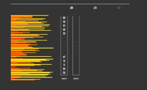

<h1 align="center">
	PUSH_SWAP（42東京のプロジェクト）
</h1>

<p align="center">
	
</p>

<p align="center">
	<b><i>最終スコア 91/100</i></b><br>
</p>

パフォーマンス
```shell
要素数が5の場合のコマンド数:
最大   : 11
中央値 : 8
最小   : 0

要素数が100の場合のコマンド数:
最大   : 738
中央値 : 656
最小   : 580

要素数が500の場合のコマンド数:
最大   : 6812
中央値 : 6309
最小   : 5903
```

## 💡 プロジェクトについて

> Push swapプロジェクトは非常にシンプルで直感的なアルゴリズムプロジェクトです：
データをソートする必要があります。
整数値のセット、2つのスタック、および両方のスタックを操作するための命令セットが用意されています。
目標は？ Push swap言語の命令で構成された最小のプログラムを作成し、標準出力に表示して、
引数として受け取った整数をソートすることです。

このプロジェクトでは、コマンドライン引数として与えられた整数列をソートする必要があります。以下の制約が指定されています：

* 使用できるのは2つのスタック（Stack_aとStack_b）のみです。
* スタック操作は指定された11個のコマンドに限定されます。
* 不正な入力に対処するための適切なエラーハンドリングを実装する必要があります（メモリリークやセグメンテーションフォルトは許可されません）。

その他の詳細なルールも存在します...

### 指定された11個のコマンド

| 命令           | 説明                                   |
|:-------------:|---------------------------------------|
| sa            | Stack_aの最初の2つの要素を交換する      |
| sb            | Stack_bの最初の2つの要素を交換する      |
| ss            | Stack_aとStack_bの最初の2つの要素を両方交換する |
| pa            | Stack_bの最初の要素をStack_aの先頭に移動する |
| pb            | Stack_aの最初の要素をStack_bの先頭に移動する |
| ra            | Stack_aの全要素を1つ上に回転させる（最初の要素が最後に移動） |
| rb            | Stack_bの全要素を1つ上に回転させる（最初の要素が最後に移動） |
| rr            | Stack_aとStack_bの全要素を1つ上に回転させる |
| rra           | Stack_aの全要素を1つ下に回転させる（最後の要素が先頭に移動） |
| rrb           | Stack_bの全要素を1つ下に回転させる（最後の要素が先頭に移動） |
| rrr           | Stack_aとStack_bの全要素を1つ下に回転させる |

## 補足情報：

このプロジェクトでは、以下の標準関数の使用が許可されています：
`read`, `write`, `malloc`, `free`, `exit`

その他の関数を使用する必要がある場合は、自分で実装する必要があります。

そのため、カスタムライブラリ [Libft](https://github.com/jayjayjay-hub/libft) を使用しました。

# 🚀 アルゴリズム

与えられた数の数に基づいてケースを分けます。

→ 要素数が少ない場合は、ルールを明示的に記述する方が効率的です（ハードコーディング）。

## 要素数が3以下の場合

1. 要素が1つの場合：何もしない
2. 要素が2つの場合：必要に応じて交換
3. 要素が3つの場合：ソートロジックをハードコーディング

## 要素数が4の場合

1. 最小の数をStack Bにプッシュ
2. 残りの3つの要素を3要素ソートアルゴリズムでソート
3. Stack Bから最小の数をStack Aに戻す

## 要素数が5以上の場合

以下のアルゴリズムを使用：

1. Stack Aに3つ以下の要素が残るまでStack Bにプッシュ
   プッシュの条件：
   * 要素がStack Bの最大値より大きい、または最小値より小さい場合、Stack Bの最大値の上にプッシュ。
     Stack Bの最大値が先頭に来るまで回転。
   * それ以外の場合、Stack B内でその要素に最も近く、かつ小さい要素の上にプッシュ。

   Stack Aからこれらの条件を満たすのに最小のコマンド数で済む要素を選択し、Stack Bにプッシュ。

2. Stack Aが3つ以下の要素になったらソート

3. Stack Bの全要素をStack Aに戻す
   プッシュの条件（ステップ1の逆）：
   * 要素がStack Aの最大値より大きい、または最小値より小さい場合、Stack Aの最小値の上にプッシュ。
     それ以外の場合、Stack A内でその要素に最も近く、かつ大きい要素の上にプッシュ。
   * Stack Bからこれらの条件を満たすのに最小のコマンド数で済む要素を選択し、Stack Aにプッシュ。

4. Stack Aを昇順になるまで回転

## 🛠️ 使用方法

### 必要条件

このライブラリはC言語で記述されており、**`cc`コンパイラ**が必要です。

### 手順

**1. コードのコンパイル**

libftライブラリとこのプロジェクトコードをコンパイルするには、パスに移動して以下を実行します：

```shell
$ make
```

**2. 実行**
push_swap実行ファイルを作成した後、ソートしたい数値をコマンドライン引数として指定します。

```shell
./push_swap 2 4 1 6 4
```

**+α. バイナリ（.o）および実行ファイルの全削除**

make中に生成されたすべてのファイルを削除するには、パスに移動して以下を実行します：

```shell
$ make fclean
```


